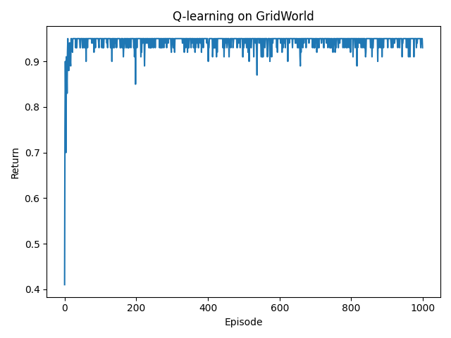
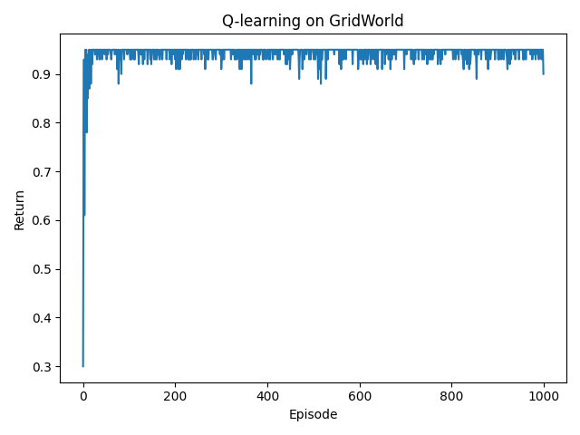
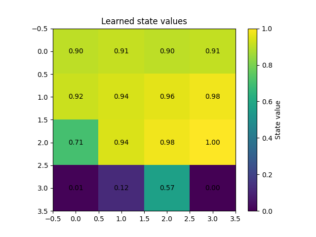

# RL GridWorld with Tabular Q-learning

This project trains a simple tabular Q-learning agent on a 4x4 GridWorld. The agent learns to navigate from the top-left start state to the bottom-right goal by balancing exploration and exploitation. The repository includes training logs, learned value visualizations, and sample outputs for inspection.

## Setup

```bash
conda create -n gridworld_env python=3.11
conda activate gridworld_env
pip install -r requirements.txt
```

## Usage

```bash
python main.py
```

## Explanation

- **Environment:** `envs/gridworld.py` defines a deterministic 4x4 grid with four actions (up, right, down, left), a start state at cell 0, and a goal at cell 15 that yields a reward of `+1` and terminates the episode. All other transitions incur a small penalty of `-0.01` to encourage short paths.
- **Algorithm:** `agents/q_learning_agent.py` implements an epsilon-greedy tabular Q-learning agent that updates its Q-table after every transition using learning rate `alpha`, discount factor `gamma`, and exploration rate `epsilon`. `main.py` orchestrates training, prints rolling-average returns, and evaluates the greedy policy after training.
- **Visualization:** Running `main.py` produces Matplotlib plots. `QLearningOnGridWorldFigure1.png` and `QLearningOnGridWorldFigure2.png` show two training runs of episode returns, and `QLearningOnGridWorldFigure3.png` renders the learned state-value heatmap.
- **Outputs:** `QLearningOnGridWorldOutput1.txt` and `QLearningOnGridWorldOutput2.txt` capture representative training logs along with the greedy trajectory and total reward.

## Results

### Learning Curves and Value Heatmap







### Sample Logs

`QLearningOnGridWorldOutput1.txt`

```
Episode 100/1000, avg return (last 100): 0.928
Episode 200/1000, avg return (last 100): 0.943
Episode 300/1000, avg return (last 100): 0.945
Episode 400/1000, avg return (last 100): 0.945
Episode 500/1000, avg return (last 100): 0.943
Episode 600/1000, avg return (last 100): 0.942
Episode 700/1000, avg return (last 100): 0.945
Episode 800/1000, avg return (last 100): 0.944
Episode 900/1000, avg return (last 100): 0.944
Episode 1000/1000, avg return (last 100): 0.945
```

`QLearningOnGridWorldOutput2.txt`

```
Episode 100/1000, avg return (last 100): 0.926
Episode 200/1000, avg return (last 100): 0.944
Episode 300/1000, avg return (last 100): 0.942
Episode 400/1000, avg return (last 100): 0.944
Episode 500/1000, avg return (last 100): 0.943
Episode 600/1000, avg return (last 100): 0.944
Episode 700/1000, avg return (last 100): 0.943
Episode 800/1000, avg return (last 100): 0.945
Episode 900/1000, avg return (last 100): 0.944
Episode 1000/1000, avg return (last 100): 0.944
Greedy trajectory: [0, 4, 5, 6, 7, 11, 15]
Total reward: 0.95
```
